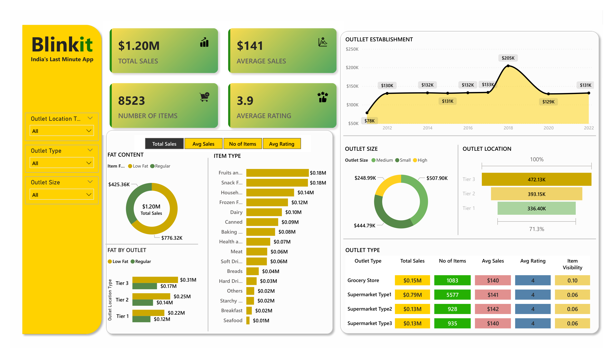

# 📊 Blinkit Sales Analysis - Power BI Project

## 📝 Project Overview

This project aims to deliver a comprehensive analysis of **Blinkit's** sales performance, customer satisfaction, and inventory distribution using **Power BI**. The analysis is based on several key performance indicators (KPIs) and detailed business requirements to uncover insights and opportunities for operational optimization.

---

## 🎯 Business Objective

To analyze Blinkit's overall performance across different outlets and product segments to:
- Understand the impact of product characteristics (e.g., fat content).
- Evaluate performance across different outlet types, sizes, and locations.
- Visualize meaningful patterns using interactive charts and dashboards.

---

## 📌 KPI Requirements

The analysis is focused on the following KPIs:

1. **Total Sales** – Overall revenue from all items sold.
2. **Average Sales** – Average revenue per transaction or item.
3. **Number of Items** – Total number of different items sold.
4. **Average Rating** – Mean customer rating of items sold.

---

## 🔍 Granular Requirements & Chart Mapping

The following specific breakdowns are required in the report, each visualized using appropriate Power BI chart types:

### 1. Total Sales by Fat Content
- **Objective**: Analyze the impact of fat content on total sales.
- **KPIs**: Total Sales, Average Sales, Number of Items, Average Rating.
- **Chart Type**: Donut Chart.

### 2. Total Sales by Item Type
- **Objective**: Identify how different item types perform in terms of total sales.
- **KPIs**: Total Sales, Average Sales, Number of Items, Average Rating.
- **Chart Type**: Bar Chart.

### 3. Fat Content by Outlet for Total Sales
- **Objective**: Compare sales across outlets segmented by fat content.
- **KPIs**: Total Sales, Average Sales, Number of Items, Average Rating.
- **Chart Type**: Stacked Column Chart.

### 4. Total Sales by Outlet Establishment
- **Objective**: Assess how outlet type or age impacts total sales.
- **Chart Type**: Line Chart.

### 5. Percentage of Sales by Outlet Size
- **Objective**: Evaluate the correlation between outlet size and total sales.
- **Chart Type**: Donut / Pie Chart.

### 6. Sales by Outlet Location
- **Objective**: Assess the geographical spread of sales.
- **Chart Type**: Funnel Map.

### 7. All Metrics by Outlet Type
- **Objective**: Provide a comprehensive breakdown of all KPIs by outlet type.
- **Chart Type**: Matrix Card.

---

## 📈 Project Steps

The analysis followed a structured approach:

1. Requirement Gathering / Business Understanding  
2. Data Walkthrough  
3. Data Connection  
4. Data Cleaning / Quality Checks  
5. Data Modeling  
6. Data Processing  
7. DAX Calculations  
8. Dashboard Layout Planning  
9. Chart Development & Formatting  
10. Dashboard / Report Creation  
11. Insights Generation  

---

## 💼 Tools Used

- **Power BI Desktop**
- **DAX**
- **Data Tutorials Framework**

---

This project provides an insightful, data-driven approach to enhancing Blinkit's sales and customer strategy using actionable visual analytics.
